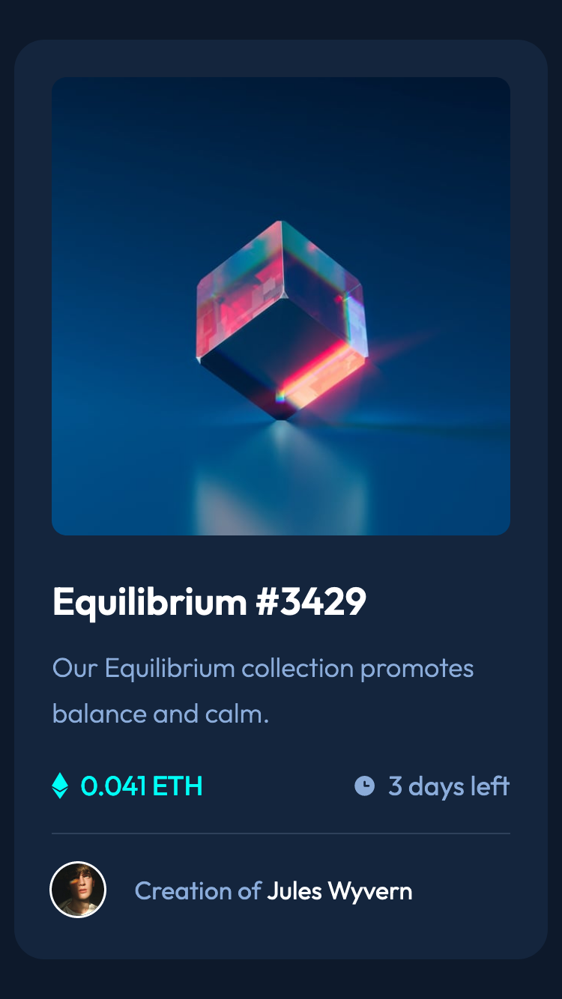

# Frontend Mentor - NFT preview card component solution

This is a solution to the [NFT preview card component challenge on Frontend Mentor](https://www.frontendmentor.io/challenges/nft-preview-card-component-SbdUL_w0U). Frontend Mentor challenges help you improve your coding skills by building realistic projects.

## Table of contents

- [Overview](#overview)
  - [The challenge](#the-challenge)
  - [Screenshot](#screenshot)
  - [Links](#links)
- [My process](#my-process)
  - [Built with](#built-with)
  - [What I learned](#what-i-learned)
  - [Useful resources](#useful-resources)
- [Author](#author)

## Overview

Building a nft preview card component.

### The challenge

Users should be able to:

- View the optimal layout depending on their device's screen size
- See hover states for interactive elements

### Screenshot

### Links

- Solution URL: [solution URL](https://github.com/A-C-Sai/nft-preview-card-component)
- Live Site URL: [live site URL](https://a-c-sai.github.io/nft-preview-card-component/)

## My process

### Built with

- Semantic HTML5 markup
- CSS custom properties
- Flexbox

### What I learned

1. ::before and ::after doesn't work with images.

### Useful resources

- [Example resource 1](https://stackoverflow.com/questions/5877910/change-before-when-hover-over-main-div) - This helped me with changing the ::before pseudo element when I hover on the main div.

## Author

- Frontend Mentor - [@A-C-Sai](https://www.frontendmentor.io/profile/A-C-Sai)
